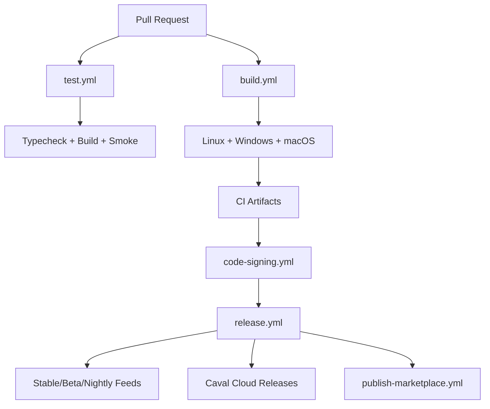
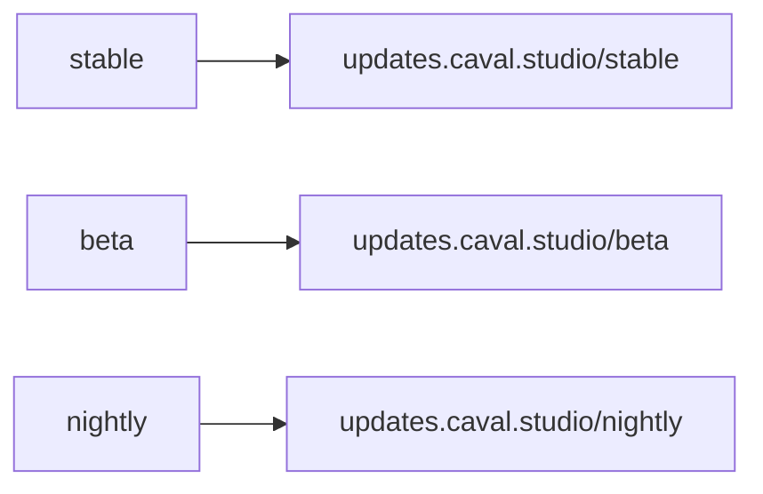
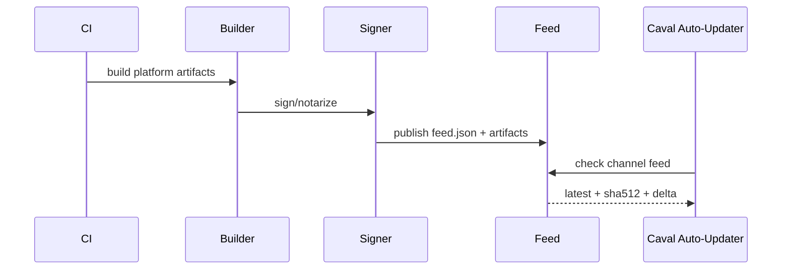

# Caval Studio CI/CD

CI/CD-ul Caval Studio este gandit pentru build si release multi-platforma, cu testare, packaging, signing, auto-update, release channels, Marketplace si observability.

## Arhitectura



## Workflows

- `build.yml`: build multi-platforma, Electron deps, installer artifacts.
- `test.yml`: unit/integration/UI smoke/AI/Context/Marketplace checks, coverage placeholder si cache.
- `code-signing.yml`: Windows EV, macOS Developer ID + notarizare, Linux optional signing.
- `release.yml`: changelog, release notes, GitHub/S3/custom publish, feed JSON.
- `nightly.yml`: build zilnic pe canalul Nightly cu tag `nightly-YYYY-MM-DD`.
- `publish-marketplace.yml`: build extensii oficiale, validare manifest, security scan si upload.

## Rulare Locala

```bash
npm run cicd:test
CAVAL_BUILD_PLATFORM=linux CAVAL_RELEASE_CHANNEL=beta npm run cicd:build-installer
CAVAL_RELEASE_CHANNEL=stable npm run cicd:publish-release
npm run cicd:publish-marketplace
```

## Release Channels



- Stable: release-uri production.
- Beta: release-uri candidate si early adopters.
- Nightly: build automat zilnic.

## Code Signing

Windows secrets:

- `CAVAL_WIN_CERT_SHA1`
- `CAVAL_WIN_CERT_FILE`
- `CAVAL_WIN_CERT_PASSWORD`

macOS secrets:

- `CAVAL_MAC_DEVELOPER_ID`
- `CAVAL_APPLE_ID`
- `CAVAL_APPLE_TEAM_ID`
- `CAVAL_APPLE_APP_PASSWORD`

Linux:

- AppImage signing si repo keys sunt optionale si pot fi adaugate prin GPG secrets.

## Release si Auto-Update

`publish-release.ts` genereaza `feed.json` cu artifact SHA512 si dimensiuni. Feed-ul este publicat catre GitHub Releases, S3 sau server custom prin configuratia din `installer/config/electron-builder.yml`.



## Marketplace

`publish-marketplace.ts`:

- descopera extensii oficiale in `extensions/**/package.json`;
- valideaza manifestul;
- ruleaza security scan;
- publica in Marketplace daca `PUBLISH_MARKETPLACE=true`.

## Metrics & Observability

Scripturile genereaza `.cicd-metrics.json` cu:

- timp build;
- timp test;
- numar artefacte;
- marime artefacte;
- platforma si canal.

Crash reporting este gestionat in `installer/updater/crash-reporter.ts`, cu suport pentru Sentry/custom server.

## Cost CI

Costul CI este estimat din:

- durata joburilor;
- numarul de platforme;
- marimea artefactelor;
- frecventa nightly.

Pentru optimizare: cache npm, build matrix paralel, nightly cu validare rapida si publish doar pe tag/channel.
