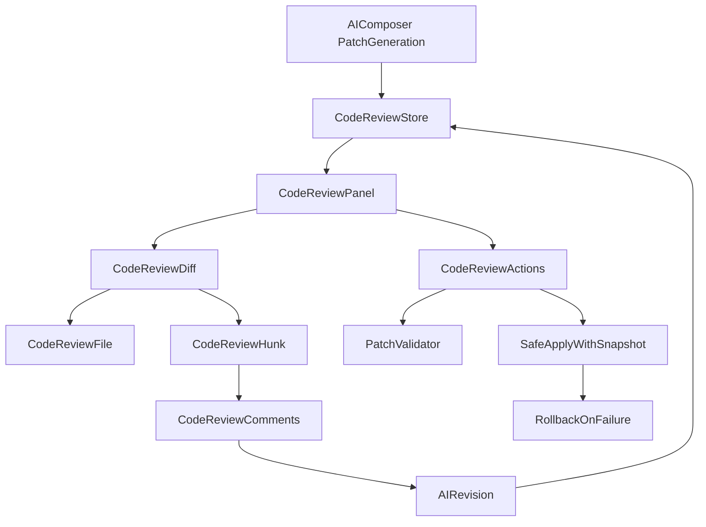

# AI Code Review Panel

CAVALLO Studio's **AI Code Review Panel** is a dedicated workspace for reviewing AI Composer patches before they touch the project. It supports multi-file diffs, granular accept/reject, threaded comments, AI revision, and safe apply with rollback.

## Architecture



## Module structure

| File | Responsibility |
|------|----------------|
| `diff-parser.ts` | Parse unified diffs into files/hunks/lines |
| `code-review-store.ts` | Normalized patch state, decisions, comments |
| `code-review-actions.ts` | acceptAll, rejectAll, per-file/hunk/line, applySelected |
| `code-review-api.ts` | Internal API: patches, comments, validate |
| `code-review-panel.tsx` | Two-column layout, global actions |
| `code-review-diff.tsx` | File list + diff viewer |
| `code-review-file.tsx` | File-level accept/reject |
| `code-review-hunk.tsx` | Hunk and line controls |
| `code-review-comments.tsx` | User and AI threaded comments |

## Review flow

1. Composer generates patch set after user approves suggestions.
2. Patches load into Code Review store — **not applied yet**.
3. User reviews diffs: accept/reject per file, hunk, or line.
4. Optional: add comments, ask AI to revise.
5. **Apply Selected** runs safe apply with snapshot + validation.
6. On build/test failure → automatic rollback.

## Accept / reject granularity

| Level | Action |
|-------|--------|
| File | Accept/reject entire file patch |
| Hunk | Accept/reject `@@` block |
| Line | Accept/reject individual `+`/`-` line |

`sessionToAcceptedPatchSet()` rebuilds a patch set from accepted items only.

## API shape (internal)

```typescript
// POST /api/review/patches
codeReviewApi.setPatches(workspaceRoot, patchSet)

// POST /api/review/comments
codeReviewApi.saveComment({ targetType, targetId, author, text })

// POST /api/review/validate
codeReviewApi.validate(sessionId)
```

## Composer integration

```typescript
// Before apply in composer.ts:
const session = codeReviewApi.setPatches(workspaceRoot, patchSet);
return { ok: true, phase: "awaiting_review", review: session, ... };

// After user applies selected:
const accepted = await codeReviewActions.applySelected();
await patchApplier.apply(workspaceRoot, accepted, dryRun);
```

## UI/UX guidelines

- Pulse Tech dark mode
- Cyan highlight for added lines
- Gold highlight for deleted lines
- Subtle AI glow on diff viewer
- Left column: changed files with status badges
- Right column: synchronized diff scroll

## Safe apply

Reuses:

- `ai/composer/rollback/snapshot-manager.ts`
- `ai/composer/rollback/rollback-engine.ts`
- `ai/composer/validation/syntax-checker.ts`
- `ai/composer/validation/build-checker.ts`

## Best practices

- Always snapshot before apply.
- Default to hunk-level review for multi-file changes.
- Use AI revision for rejected hunks with comments.
- Validate accepted patch set before writing to disk.
