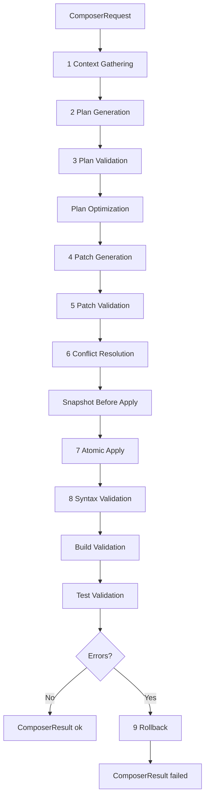
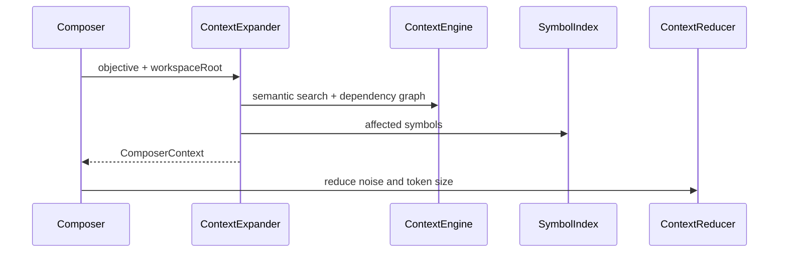

# AI Composer

AI Composer-ul Caval Studio este motorul enterprise pentru modificari complexe in cod: context gathering, planificare, patch-uri multi-file, validare, aplicare atomica si rollback.

## Structura

- `ai/composer/composer.ts` orchestreaza pipeline-ul complet.
- `ai/composer/plan/` contine generator, validator si optimizer.
- `ai/composer/patch/` contine generator, formatter, validator, conflict resolver si applier atomic.
- `ai/composer/context/` extinde, reduce si combina contextul din Context Engine.
- `ai/composer/validation/` ruleaza syntax checks, build si tests.
- `ai/composer/rollback/` creeaza snapshot-uri si revine la fisierele afectate.
- `ai/composer/prompts/` version-eaza prompturile composerului.

## Pipeline

## Integrare AI Layer

Composer-ul foloseste:

- `AIClient` pentru completions si safety guard.
- `ModelRouter` pentru rutare catre Nex N2 Pro, StepFun, Laguna si fallback local.
- `ReasoningAgent`, `DebugAgent`, `RefactorAgent` ca dependinte disponibile pentru extensii ale pipeline-ului.

## Integrare Context Engine

## Patch Engine

- `ComposerPatchGenerator` cere patch-uri JSON cu diff-uri sau `fullContent`.
- `PatchFormatter` normalizeaza paths si whitespace.
- `PatchValidator` blocheaza path traversal, patch-uri goale si conflict markers.
- `ConflictResolver` escaladeaza conflictele nesigure la utilizator.
- `AtomicPatchApplier` calculeaza toate scrierile inainte de aplicare.

## Rollback

Snapshot-urile sunt create in memorie inainte de aplicare:

- fisiere existente: continutul complet este pastrat;
- fisiere noi: sunt marcate ca inexistente;
- rollback poate reveni complet sau doar pe fisiere afectate.

## Validation

- `SyntaxChecker`: TS/JS prin TypeScript compiler API; Python/Go/Rust/Java prin sanity checks de delimitatori, cu extensie ulterioara catre toolchain-uri native.
- `BuildChecker`: ruleaza comanda de build.
- `TestRunner`: ruleaza testele proiectului.

## Best Practices

- Ruleaza `dryRun` pentru schimbari mari.
- Activeaza `runBuild` si `runTests` pentru modificari cross-module.
- Pastreaza planuri scurte si patch-uri reviewable.
- Daca `ConflictResolver.requiresUser` este `true`, nu aplica automat patch-ul.
