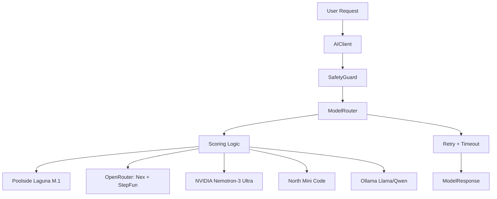
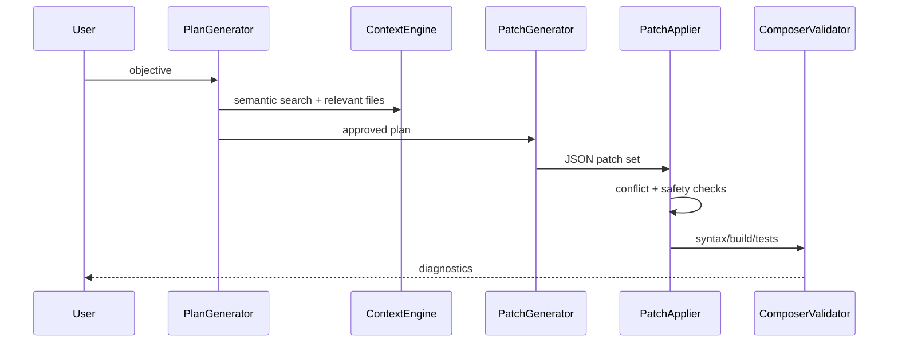

# AI Layer

AI Layer-ul CAVALLO Studio este modular, scalabil si pregatit pentru modele frontier, fallback local si integrare directa cu Context Engine.

## Structura

- `ai/ai-client.ts` este fatada interna pentru completions si streaming.
- `ai/model-router.ts` face scoring, routing, retry, timeout si fallback.
- `ai/providers/` contine clientii API pentru Poolside, OpenRouter, NVIDIA, North si Ollama/local.
- `ai/composer/` gestioneaza planuri, patch-uri, aplicare si validare.
- `ai/agents/` contine agenti refactor, debug, reasoning si documentation.
- `ai/safety/` contine rate limiting, token limits, patch limits si blocaje pentru operatii periculoase.
- `ai/prompts/` version-eaza prompturile system, agents, composer si safety.
- `ai/get-context.ts`, `ai/get-relevant-files.ts`, `ai/get-symbols.ts` conecteaza AI Layer-ul la Context Engine.

## Routing

| Intent | Model preferat | Motiv |
| --- | --- | --- |
| `kilocode`, `multi_file`, `codebase` | Poolside Laguna M.1 | schimbari multi-file si intelegere codebase |
| `agent`, `tool_use`, `planning` | StepFun Step 3.7 Flash | agentic flow si tool calling |
| `reasoning`, `deep_thinking` | Nex N2 Pro | rationament avansat |
| `debug`, `analysis` | NVIDIA Nemotron-3 Ultra | debugging si analiza |
| `autocomplete`, `fast` | North Mini Code | latenta mica |
| `fallback` | Llama/Qwen local | rezilienta si private mode |

## Diagrama Routing

## Diagrama Composer

## Provideri si Env Vars

- Poolside: `POOLSIDE_API_KEY`, endpoint `https://api.poolside.ai/v1/chat/completions`.
- OpenRouter: `OPENROUTER_API_KEY`, endpoint `https://openrouter.ai/api/v1/chat/completions`.
- NVIDIA: `NVIDIA_API_KEY`, endpoint `https://integrate.api.nvidia.com/v1/chat/completions`.
- North: `NORTH_API_KEY`, endpoint `https://api.north.ai/v1/chat/completions`.
- Fallback local: `OLLAMA_BASE_URL`, default `http://localhost:11434/api/chat`.

## Safety

Safety Layer aplica:

- rate limiting per workspace;
- `maxTokens`;
- `maxPatchBytes`;
- `maxFileCount`;
- blocaje pentru comenzi destructive;
- protectie path traversal in patch applier;
- detectare conflict markers in fisiere.

## Best Practices

- AI-ul cere context prin Context Engine, nu prin citiri globale necontrolate.
- Prompturile sunt fisiere versionate, nu string-uri ascunse in cod.
- Routerul pastreaza fallback local pentru rezilienta si private mode.
- Composer-ul separa plan, patch, apply si validate pentru reviewability.
