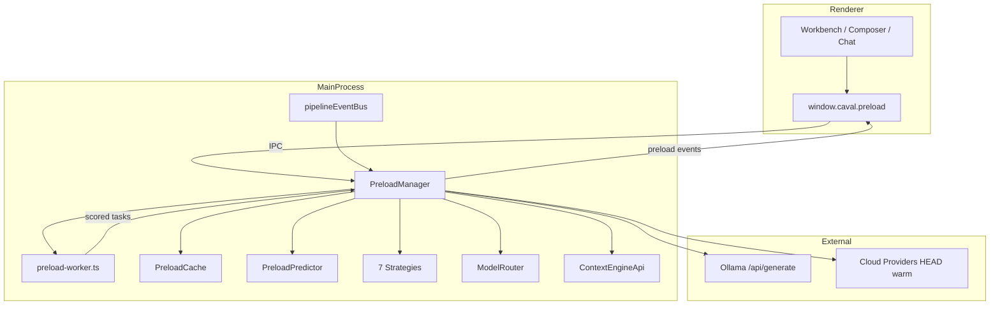
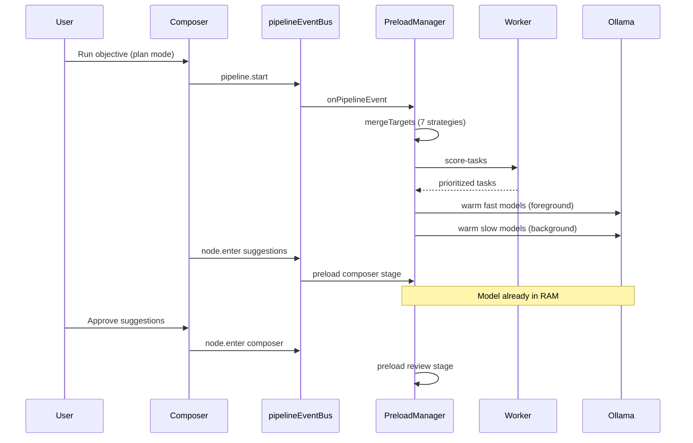

# AI Intelligent Preload Engine

Modulul **AI Intelligent Preload Engine** încarcă modelele AI înainte ca utilizatorul să le ceară explicit, reducând latența percepută în pipeline-ul Caval Studio (Suggestions → Composer → Review).

## Structură

```
ai/preload/
├── preload-manager.ts    # Orchestrator principal (main process)
├── preload-strategy.ts   # 7 strategii de preload
├── preload-predictor.ts  # Predicție modele + pipeline
├── preload-cache.ts      # Cache inteligent + istoric adaptiv
├── preload-events.ts     # Event bus dedicat
├── preload-worker.ts     # Worker thread (scoring + scheduling)
└── index.ts              # Export public
```

Integrare IPC: `src/main/preload-handlers.ts`  
Worker compilat: `dist/main/preload-worker.js`

## Arhitectură



## Flux pipeline AI



## Strategii

| Strategie | Rol |
|-----------|-----|
| **predictive** | Anticipă modele din istoric + heuristici |
| **contextual** | Fișiere deschise, tab activ, workspace |
| **orchestrated** | Suggestions → Composer → Review |
| **parallel** | Modele rapide foreground, lente background |
| **lazy** | Doar dacă cache miss |
| **warm-cache** | Reîncălzire modele cu hit-uri recente |
| **adaptive** | Ajustare greutăți din hit/miss ratio |

## Reguli de operare

- **Non-blocking UI** — toate warm-urile sunt async, cu AbortController
- **Worker threads** — scoring și scheduling în preload-worker.ts
- **Cache inteligent** — max 6 modele, LRU + priority, persist `.caval/preload-cache.json`
- **Eviction** — modele nefolosite > 2 min, keep_alive: 0 pentru Ollama
- **Prioritate** — ultra_fast / fast în foreground (max 2 concurrent)
- **Background** — modele slow (ex. llama3.1:70b) max 2 concurrent

## Integrări

| Componentă | Hook |
|------------|------|
| AI Pipeline | pipelineEventBus.on() în PreloadManager |
| AI Composer | caval:composer-run → onUserAction |
| AI Suggestions | pipeline node.enter suggestions |
| AI Review | pipeline node.enter review |
| Context Engine | onWorkspaceOpen → indexWorkspace |
| Model Router | rankForIntent(), warm cloud via HEAD |
| Chat stream | model-handlers.ts → recordUsage + notify |

## API Renderer

```typescript
const status = await window.caval.preload.status();
await window.caval.preload.warm("qwen2.5-coder:7b", "chat");
await window.caval.preload.notify({
  action: "files.changed",
  openFiles: ["src/app.tsx"],
  activeFile: "src/app.tsx",
});
window.caval.preload.subscribe();
const off = window.caval.preload.onEvent((e) => console.log(e.type, e.modelId));
```

## Teste

```bash
npm test -- tests/preload/preload-engine.test.ts
```
