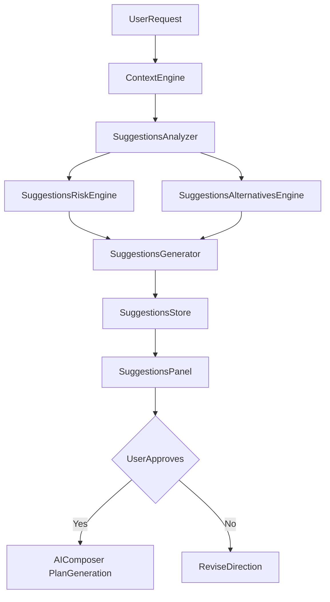

# AI Suggestions Before Review

CAVALLO Studio's **AI Suggestions Before Review** module analyzes user requests and codebase context *before* AI Composer generates patches. It gives developers a conceptual preview, risk assessment, and alternative approaches — increasing control and reducing unnecessary diffs.

## Architecture



## Module structure

| File | Responsibility |
|------|----------------|
| `suggestions-analyzer.ts` | Extract symbol impact, dependencies, side effects |
| `suggestions-risk.ts` | Classify breaking/perf/security/architecture risks |
| `suggestions-alternatives.ts` | Generate minimal/optimized/complete/aggressive options |
| `suggestions-generator.ts` | Orchestrate analysis + optional AI narrative |
| `suggestions-store.ts` | Session state, approval, proceed hooks |
| `suggestions-api.ts` | `submitRequest`, `approve`, `reject`, `proceedToComposer` |
| `suggestions-panel.tsx` | Pulse Tech UI with expandable sections |

## Flow

1. User sends a Composer request (Plan mode recommended).
2. Context Engine gathers relevant files, symbols, dependency graph.
3. Suggestions module produces summary, risks, alternatives, estimated scope.
4. UI opens `ai-suggestions` panel — **no patches yet**.
5. User approves direction (optionally selects alternative) → Composer continues to plan/patch generation.

## Composer integration

In `ai/composer/composer.ts`, the pipeline pauses after context merge:

```typescript
if (!request.skipSuggestions) {
  const bundle = await suggestionsApi.submitRequest(request.objective, request.workspaceRoot);
  return { ok: true, phase: "awaiting_suggestions", suggestions: bundle, ... };
}
```

After `proceedToComposer(sessionId)`, Composer resumes with plan generation.

## Agent integration

- Reasoning agent (`intent: deep_thinking`) enriches the summary narrative.
- Suggestions engine **never** emits code — enforced by system prompts in `prompts/suggestions-system.md`.

## UI/UX guidelines

- Dark mode default (Pulse Tech)
- Cyan glow on hero section
- Expandable sections: Symbol Impact, Risks, Alternatives, Dependencies
- Primary CTA: **Proceed to Patch Generation**
- Secondary: Approve Direction, Reject

## Best practices

- Always show suggestions for multi-file or high-risk requests.
- Default to the **optimized** alternative unless user selects otherwise.
- Surface security and breaking-change risks prominently.
- Keep estimated line ranges conservative to set expectations.

## API (internal)

```typescript
suggestionsApi.submitRequest(request, workspaceRoot)
suggestionsApi.approve({ sessionId, alternativeId, notes })
suggestionsApi.reject(sessionId, notes)
suggestionsApi.proceedToComposer(sessionId)
```
