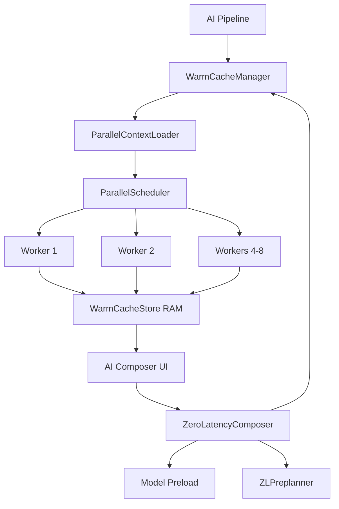
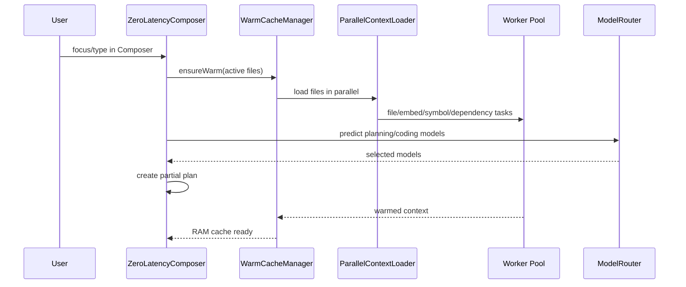

# Context Warm Cache, Parallel Loading, Zero Latency Composer

## Architecture



## Parallel Context Loading

Files:

```text
ai/context/parallel/
  parallel-loader.ts
  parallel-scheduler.ts
  parallel-worker.ts
  parallel-priority.ts
  parallel-batching.ts
  parallel-types.ts
```

The loader splits large files into batches, schedules work with `HIGH | MEDIUM | LOW` priority, and sends work to a worker thread pool. The worker extracts:

- indexed documents
- deterministic embeddings
- symbols
- dependency edges
- semantic summaries

Example:

```ts
import { parallelContextLoader } from "../ai/context/parallel";

const result = await parallelContextLoader.loadWorkspace({
  workspaceRoot,
  activeFile,
  priority: "HIGH",
});
```

## Context Engine Warm Cache

Files:

```text
ai/context/warm-cache/
  warm-cache-manager.ts
  warm-cache-loader.ts
  warm-cache-predictor.ts
  warm-cache-store.ts
  warm-cache-types.ts
```

Warm Cache keeps context in RAM and updates only changed files by comparing content hashes. It integrates with:

- Context Engine restore/index
- Parallel Context Loader
- Model Router predictive warm
- AI Pipeline events

Example:

```ts
import { warmCacheManager } from "../ai/context/warm-cache";

warmCacheManager.warmAtStartup(workspaceRoot);
warmCacheManager.onProjectChange(workspaceRoot);
warmCacheManager.onFileOpen(filePath, content);
warmCacheManager.onFileChange(filePath, nextContent);
```

## Zero Latency Composer

Files:

```text
ai/composer/zero-latency/
  zl-composer.ts
  zl-preplanner.ts
  zl-context-preloader.ts
  zl-model-preloader.ts
  zl-cache.ts
  zl-scheduler.ts
  zl-types.ts
```

Zero Latency Composer schedules warm cache, context preload, model preload, and partial planning while the user is typing. The partial plan is local and cheap; the final Composer can replace it with model output.

Example:

```ts
import { zeroLatencyComposer } from "../ai/composer/zero-latency";

const tokenId = zeroLatencyComposer.prepare({
  workspaceRoot,
  objectiveDraft: "Add auth middleware",
  activeFile,
  openFiles,
  language: "ts",
  projectType: "backend",
});

const cached = zeroLatencyComposer.getCached(workspaceRoot, "Add auth middleware");
zeroLatencyComposer.cancel(tokenId);
```

## Sequence


