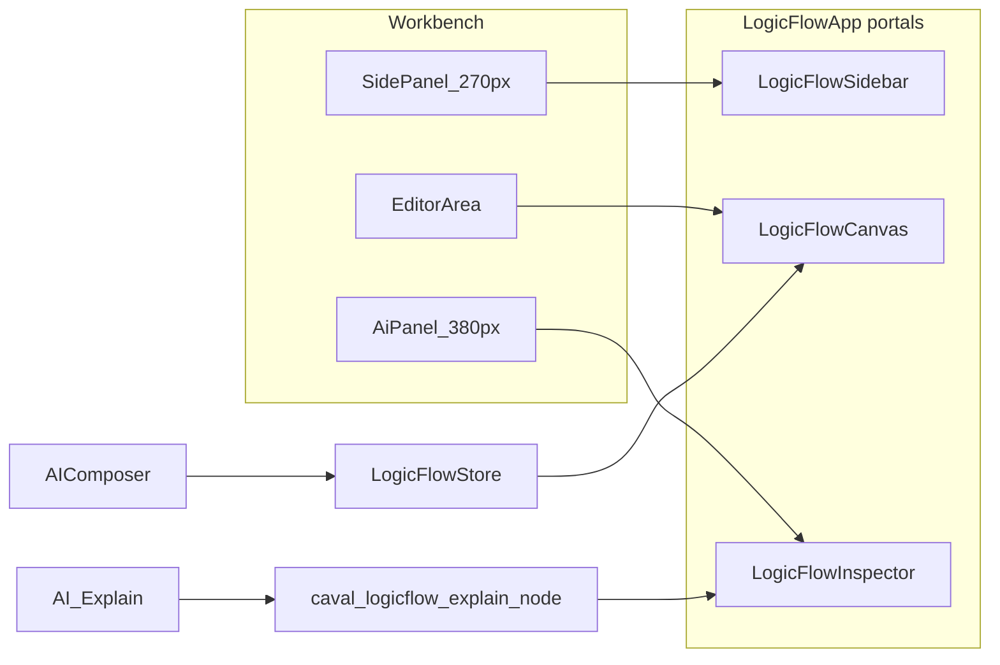

# LogicFlow Pipeline UI

Cursor-style visualization of the Caval Studio AI Composer pipeline: sidebar (stages), canvas (connected nodes), and AI inspector (right panel).

## Architecture



## Layout

When **AI Pipeline** (activity bar `⬡`) is active:

| Zone | Component | Role |
|------|-----------|------|
| Left `side-panel` | `LogicFlowSidebar` | Stage list, click to select + explain |
| Center `editor-area` | `LogicFlowCanvas` | Nodes, edges, toolbar, minimap |
| Right `ai-panel` | `LogicFlowInspector` | AI explanation for selected node |

Composer chat returns when switching to any other panel.

## Pipeline nodes

| Node ID | Label | Composer phase |
|---------|-------|----------------|
| `suggestions` | AI Suggestions | `awaiting_suggestions` |
| `composer` | AI Composer | plan/patch in progress (`running`) |
| `review` | Code Review | `awaiting_review` |
| `debug` | AI Debug | support / error diagnosis |

Edges: `suggestions → composer → review → debug`

## Files

```
components/ui/logicflow/
  types.ts
  LogicFlowStore.ts          # zustand
  LogicFlowNode.tsx
  LogicFlowEdge.tsx
  LogicFlowCanvas.tsx
  LogicFlowToolbar.tsx
  LogicFlowMiniMap.tsx
  LogicFlowSidebar.tsx
  LogicFlowInspector.tsx
  LogicFlowApp.tsx           # React portals
  logicflow-agent.ts
  logicflow-api.ts
  prompts/logicflow-explain.md
  index.ts
src/renderer/logicflow-mount.tsx   # window.CavalLogicFlow
```

## IPC

| Channel | Direction | Purpose |
|---------|-----------|---------|
| `caval:logicflow-explain-node` | renderer → main | AI explanation for a pipeline node |

Preload API: `caval.logicflowExplainNode(request)`

## Build

Webpack bundles `renderer/logicflow-mount.js` alongside `workbench.js`. Pulse Tech CSS (`pulse-tech.css`) provides tokens and Tailwind utilities.

```bash
npm run build
npm start
```

Open **AI Pipeline** from the activity bar. Click a node or use **AI Explain** in the toolbar.

## Live AI Flow

When **Live AI Flow: ON** (toolbar toggle):

- Pipeline steps emit via `EventBus` / `pipelineEventBus` → IPC `caval:pipeline-event` → renderer store
- Active node glows with `.pt-glow`
- Incoming edge pulses with `.pt-edge-active`
- Bottom **Timeline** syncs with the active stage

## Event Bus and Debug Timeline

- **Renderer:** [`components/ui/logicflow/EventBus.ts`](components/ui/logicflow/EventBus.ts)
- **Main process:** [`ai/pipeline/pipeline-event-bus.ts`](ai/pipeline/pipeline-event-bus.ts)
- **Event types:** `PipelineEvent` in [`components/ui/logicflow/types.ts`](components/ui/logicflow/types.ts)
- **Debug panel:** [`ai/debug/AIDebugPanel.tsx`](ai/debug/AIDebugPanel.tsx) — tab in LogicFlow Inspector (Debug Timeline)
- **Replay:** [`components/ui/logicflow/replay.ts`](components/ui/logicflow/replay.ts) + toolbar Replay button
- **Demo:** toolbar **Demo Pipeline** runs [`demo-pipeline.ts`](components/ui/logicflow/demo-pipeline.ts)

| Event type | UI effect |
|------------|-----------|
| `pipeline.start` | Reset session events |
| `node.enter` | Activate node |
| `edge.activate` | Pulse edge |
| `tool.call` / `tool.result` | Debug timeline log |
| `error.occurred` | Auto-switch to Debug tab |
| `pipeline.finish` | Mark pipeline complete |

Transitions use `.pt-glow` on nodes and `.pt-edge-active` on edges (`edgePulse` animation).

| Transition | Active node | Pulsing edge |
|------------|-------------|--------------|
| Start suggestions | `suggestions` | — |
| → Composer | `composer` | `e1` |
| → Review | `review` | `e2` |
| → Debug (errors) | `debug` | `e3` |

Turn **Live AI Flow: OFF** to keep the canvas static while exploring.

## Coexistence

- `ai-suggestions` and `code-review` panels still open automatically during Composer Plan mode.
- LogicFlow syncs active node highlights via `CavalLogicFlow.syncPhase()` when Composer runs.
- No changes to `ui-kit/` or existing gate panels.
