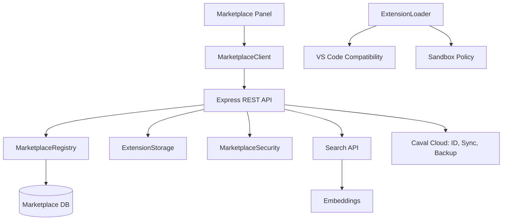
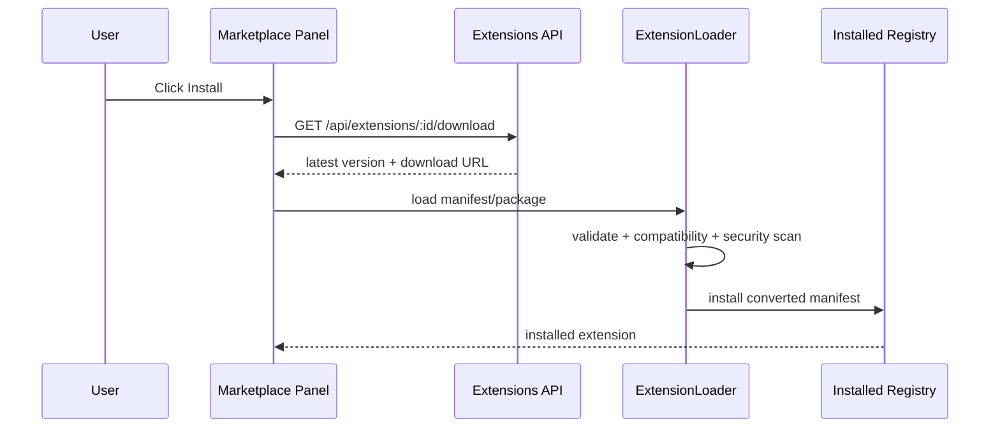
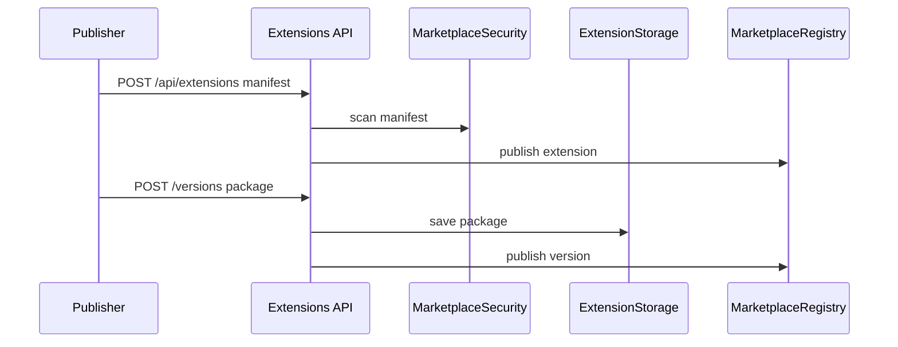
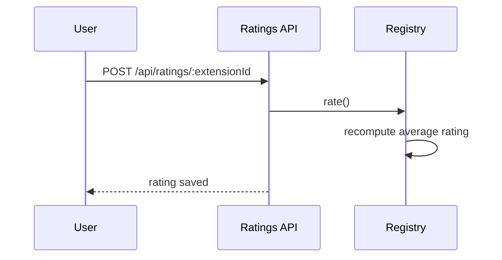
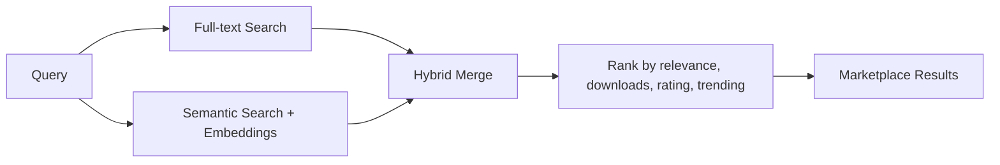

# Marketplace Caval

Marketplace-ul Caval este sistemul de distributie pentru extensii, pluginuri, teme, AI tools si integrarea cu Caval Cloud. Este construit ca un serviciu modular: server REST, registry, storage, security scanner, client UI si extension loader compatibil VS Code.

## Arhitectura

## Structura

- `marketplace/server/index.ts` si `server.ts` pornesc serverul Marketplace.
- `marketplace/server/api/` contine rutele REST pentru extensions, users, auth, ratings si search.
- `marketplace/server/db/schema.sql` defineste tabelele `users`, `extensions`, `extension_versions`, `ratings`, `downloads`, `categories`.
- `marketplace/server/utils/` contine validator, storage si security.
- `marketplace/client/ui/` contine panelul Marketplace, carduri, detalii si search bar.
- `marketplace/client/hooks/` contine hook-uri React pentru extensii si search.
- `marketplace/extensions/` contine loader, registry instalari, manifest validator si compatibilitate VS Code.

## API

### `/api/extensions`

- `GET /api/extensions` listeaza extensii.
- `POST /api/extensions` publica extensie noua pe baza manifestului.
- `POST /api/extensions/:extensionId/versions` publica versiune noua.
- `GET /api/extensions/:extensionId` returneaza detalii + versiuni.
- `GET /api/extensions/:extensionId/download` inregistreaza download si returneaza versiunea.
- `GET /api/extensions/categories` returneaza categorii.
- `GET /api/extensions/trending` returneaza extensii trending.
- `GET /api/extensions/featured` returneaza extensii featured.

### `/api/users`

- `POST /api/users` creeaza profil Marketplace legat de Caval ID.
- `GET /api/users/:userId` returneaza profil.
- `GET /api/users/:userId/published` listeaza extensii publicate.
- `PUT /api/users/:userId/extensions/sync` sincronizeaza extensii instalate.
- `PUT /api/users/:userId/settings/backup` salveaza backup setari.

### `/api/auth`

- `POST /api/auth/login` emite access token JWT si refresh token.
- `POST /api/auth/refresh` reinnoieste access token-ul.

### `/api/ratings`

- `GET /api/ratings/:extensionId` listeaza review-uri.
- `POST /api/ratings/:extensionId` creeaza sau actualizeaza rating.

### `/api/search`

- `GET /api/search?q=&mode=hybrid` ruleaza cautare full-text + semantic search.
- `GET /api/search/autocomplete?q=` returneaza sugestii instant.

## Flow Instalare Extensii

## Flow Upload Extensii

## Flow Rating

## Flow Cautare

## Securitate

- Manifest validation pentru `name`, `publisher`, `version`, `engines`.
- Scanare manifest pentru pattern-uri periculoase.
- Permission review pentru `cavalPermissions`.
- Sandboxing policy pentru filesystem/network/workspace.
- Compatibilitate VS Code prin conversion adapter.

## Caval Cloud

Marketplace-ul include endpoint-uri pentru:

- sincronizare extensii instalate;
- backup setari;
- profil unic Caval ID;
- extensii publicate per publisher.
