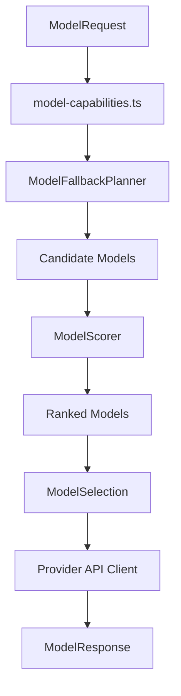
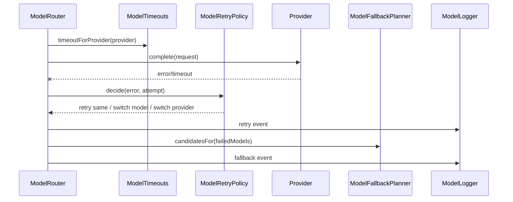

# Model Router

Model Router-ul Caval Studio este creierul AI Layer-ului. Alege modelul optim pentru fiecare task folosind profile centralizate, mapping de capabilities, scoring ponderat, fallback, retry, timeout si logging.

## Fisiere

- `ai/model-router.ts` orchestreaza selectia, completions si streaming.
- `ai/model-profiles.ts` descrie toate modelele frontier si fallback.
- `ai/model-capabilities.ts` mapeaza intent-uri la modele preferate.
- `ai/model-scorer.ts` calculeaza scorul final.
- `ai/model-fallback.ts` genereaza candidatii de fallback.
- `ai/model-retry.ts` decide retry/switch model/switch provider.
- `ai/model-timeouts.ts` defineste timeouts per provider.
- `ai/model-logger.ts` logheaza scoruri, selectie, retry si fallback.

## Modele

| Model | Provider | Context | Viteza | Cost | Latenta | Specializare |
| --- | --- | ---: | --- | --- | --- | --- |
| Poolside Laguna M.1 | `poolside` | 256k | balanced | premium | medium | coding, planning |
| Nex N2 Pro | `openrouter` | 128k | balanced | high | medium | reasoning, coding |
| StepFun Step 3.7 Flash | `openrouter` | 64k | fast | medium | low | tool use, planning, coding |
| NVIDIA Nemotron-3 Ultra | `nvidia` | 128k | balanced | high | medium | debugging, reasoning |
| North Mini Code | `north` | 32k | ultra fast | low | low | autocomplete, coding |
| Llama 3.1 70B | `open_source` | 128k | slow | local | high | reasoning, coding |
| Qwen 2.5 Coder 32B | `open_source` | 128k | balanced | local | medium | coding, reasoning |

## Capability Routing

| Intent | Primary | Fallback |
| --- | --- | --- |
| `kilocode`, `multi_file`, `codebase` | Poolside Laguna M.1 | Qwen 2.5 Coder 32B, StepFun |
| `agent`, `tool_use`, `planning` | StepFun Step 3.7 Flash | Nex N2 Pro, Qwen |
| `reasoning`, `deep_thinking` | Nex N2 Pro | StepFun, Llama |
| `debug`, `analysis` | NVIDIA Nemotron-3 Ultra | Nex, Llama |
| `autocomplete`, `fast` | North Mini Code | Qwen, StepFun |
| `fallback` | Qwen 2.5 Coder 32B | Llama, North |

## Scoring

Formula folosita de `ModelScorer`:

```txt
finalScore =
  weightTask * taskScore +
  weightContext * contextScore +
  weightLatency * latencyScore +
  weightCost * costScore +
  weightSpecialization * specializationScore
```

Default weights:

- `weightTask`: 0.35
- `weightContext`: 0.20
- `weightLatency`: 0.15
- `weightCost`: 0.10
- `weightSpecialization`: 0.20

Output selectie:

```json
{
  "provider": "poolside",
  "model": "poolside-laguna-m-1",
  "reason": "task=100; context=100; latency=75; cost=45; specialization=100; primary-route:kilocode",
  "score": 85.75
}
```

## Diagrama Selectiei



## Retry, Timeout si Fallback



## Timeouts

- Poolside: 70s
- OpenRouter: 45s
- NVIDIA: 55s
- North: 12s
- Open-source local: 90s

## Logging

`ModelLogger` inregistreaza:

- `model_score`
- `model_selected`
- `model_retry`
- `model_fallback`
- `model_error`

Seteaza `CAVAL_AI_ROUTER_DEBUG=1` pentru logare in consola.

## Provideri

- Poolside: `POOLSIDE_API_KEY`
- OpenRouter: `OPENROUTER_API_KEY`
- NVIDIA: `NVIDIA_API_KEY`
- North: `NORTH_API_KEY`
- Ollama/local: `OLLAMA_BASE_URL`, default `http://localhost:11434/api/chat`
