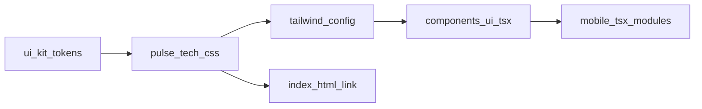

# Pulse Tech UI Kit

Pulse Tech is Caval Studio's Tailwind-based React component layer in `components/ui/`. It runs **in parallel** with the legacy `ui-kit/` (`caval-*` CSS classes) — use Pulse Tech for new React modules; keep `ui-kit` for marketplace and existing surfaces until migrated.

## Architecture



## When to use which kit

| Use case | Import from |
|----------|-------------|
| New React modules (mobile build, future panels) | `components/ui` |
| Marketplace, legacy panels, `caval-*` styling | `ui-kit/` |

## Design tokens

CSS variables live in `styles/pulse-tech.css` (`:root`). They align with `ui-kit/tokens/colors.ts`:

| `--pt-*` variable | ui-kit token |
|-------------------|--------------|
| `--pt-deep-blue` | `deepBlue` |
| `--pt-cyan` | `cyanPulse` |
| `--pt-gold` | `carpathianGold` |
| `--pt-text-primary` | `softWhite` |
| `--pt-text-secondary` | `mountainGrey` |
| `--pt-surface-1` | `graphiteBlack` |
| `--pt-surface-2` | `graphiteBlackElevated` |

Tailwind theme extensions in `tailwind.config.js` map utilities like `text-pt-cyan`, `bg-pt-surface-2`, `shadow-pt-cyan`.

## Animations

| Class | Effect |
|-------|--------|
| `.pt-glow`, `.pt-pulse` | Cyan pulse glow (`pulseTech` keyframes) |
| `.pt-scanline` | Scanline overlay (`scanline` keyframes) |

## Components

All exports from `components/ui/index.ts`:

- **Button** — `variant: primary | secondary | ghost`, `size: sm | md | lg`
- **Card** — bordered surface with hover glow
- **Panel** — titled container
- **Tabs** — tabbed content switcher
- **Input** — labeled text input with `forwardRef`
- **Modal** — overlay dialog; Escape and backdrop click close
- **Divider** — horizontal rule
- **SectionTitle** — cyan section heading

### Example

```tsx
import { Button, Card, Panel, Input, Modal } from "../components/ui";

<Panel title="Build">
  <Input label="App name" placeholder="My App" />
  <Button variant="primary" size="sm">Start</Button>
</Panel>
```

## Build

Compile Tailwind CSS:

```bash
npm run build:css
```

Output: `dist/renderer/pulse-tech.css`. The full build runs this automatically:

```bash
npm run build
```

`src/renderer/index.html` links `./pulse-tech.css` so the renderer loads Pulse Tech tokens and utilities alongside existing `.cs-*` workbench styles.

## Toolchain

- `tailwind.config.js` — content paths + theme extensions
- `postcss.config.js` — `tailwindcss` + `autoprefixer`
- `styles/pulse-tech.css` — tokens, `@tailwind` directives, animation utilities

Webpack does **not** bundle TSX yet; React modules are typechecked only. CSS is built via PostCSS CLI (phase 1). Future: extend webpack for `.tsx` + CSS imports.

## Mobile integration

`mobile/mobile-build-header.tsx`, `mobile-build-actions.tsx`, and `mobile-build-tutorial.tsx` import `Button` (and `Modal` for the tutorial) from `components/ui/`.
