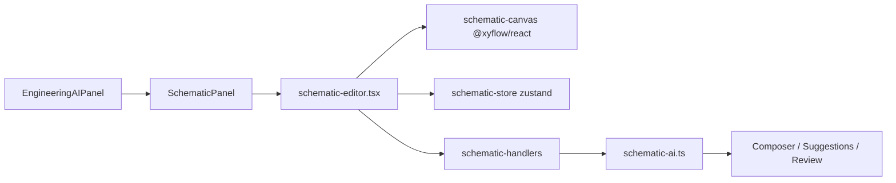

# Schematic Editor

CAVALLO Studio Schematic Editor is a KiCad-inspired, bidirectional system visualization tool for code: functions, classes, modules, API endpoints, state, events, data structures, AI agents, and external dependencies.

## Architecture

## Module layout

| Path | Role |
|------|------|
| `ai/schematic/schematic-types.ts` | Graph schema, node/edge types |
| `ai/schematic/schematic-store.ts` | Renderer Zustand + React Flow sync |
| `ai/schematic/schematic-layout.ts` | dagre auto-layout, semantic zoom filter |
| `ai/schematic/schematic-history.ts` | Undo/redo |
| `ai/schematic/schematic-analysis.ts` | Client-side conflict detection |
| `ai/schematic/schematic-ai.ts` | Main-process AI (code ↔ schematic) |
| `ai/schematic/schematic-composer-bridge.ts` | Routes patches to Suggestions → Review |
| `ai/schematic/schematic-editor.tsx` | UI orchestrator |
| `ai/schematic/prompts/*.md` | AI prompt system |

## UI

- **Toolbar (left):** select, connect, edit modes; semantic zoom (module/class/function); undo/redo; auto-layout; add node; AI actions
- **Canvas (center):** infinite pan/zoom grid, capsule nodes, cyan glow edges
- **Minimap (bottom-right):** overview navigation
- **Inspector (right):** node/edge details, AI explanations, architecture issues

### Shortcuts

| Key | Action |
|-----|--------|
| Delete / Backspace | Delete selection |
| Ctrl+Z | Undo |
| Ctrl+Y / Ctrl+Shift+Z | Redo |

## Node types

`function`, `class`, `module`, `api_endpoint`, `state`, `event`, `data_structure`, `ai_agent`, `external_dependency`

## Edge types

`call`, `data_flow`, `dependency`, `event`, `ai_reasoning`

## AI integration (3 directions)

### 1. Code → Schematic

Robotics AI → **Generează schematic din cod** or toolbar **C→S**.

IPC: `schematic:generateFromCode` → `SchematicAI.generateFromCode()` uses Context Engine + `schematic-transform.md` → dagre layout.

### 2. Edit Schematic

Manual: drag nodes, connect pins (connect mode), add/delete, reorganize. Undo/redo tracked in `schematic-history.ts`.

### 3. Schematic → Code

Toolbar **S→C** → `schematic:generateCode` → patches → **AI Suggestions Before Review** (optional) → **Code Review Panel** → Composer apply.

## IPC API (`window.caval.schematic`)

- `generateFromCode({ workspaceRoot, objective?, files?, useSample? })`
- `generateCode({ workspaceRoot, graph, delta, skipSuggestions? })`
- `explain({ graph, nodeId?, edgeId? })`
- `analyze({ graph })`
- `autoLayout({ graph })`

## Best practices

1. Generate from code first, then refine manually.
2. Run **Analyze** before generating code to catch circular dependencies.
3. Use semantic zoom to focus on module vs function level.
4. Review all patches in Composer before applying.

## Entry point

Activity bar → **Robotics AI** → tab **Schematic**.
