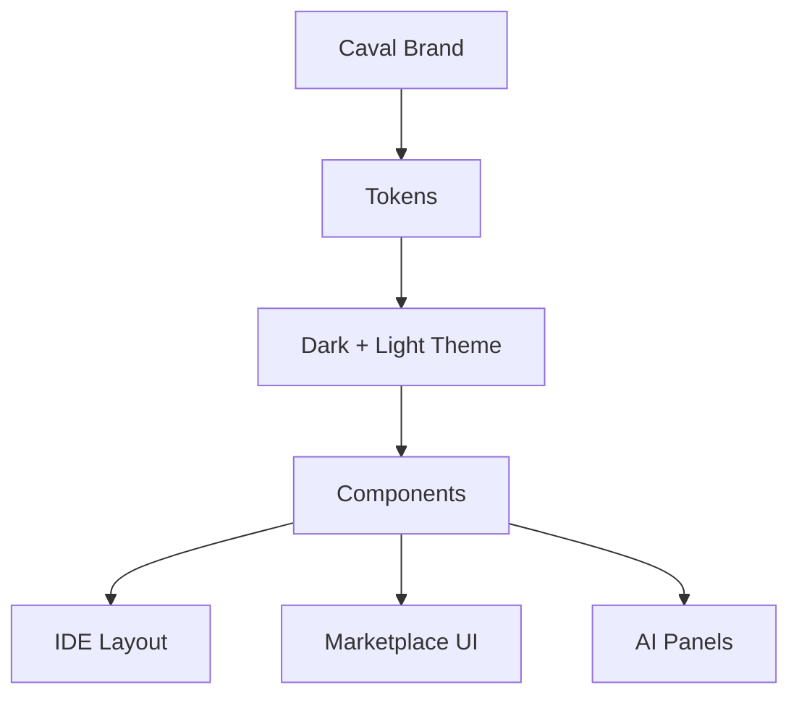

# UI Kit

Documentatia principala pentru UI Kit este in `ui-kit/docs/ui-kit.md`.

## Diagrama Rapida

UI Kit-ul include tokens, componente React, layout helpers, theme provider, iconografie monoline, animatii si best practices pentru Caval Studio.
