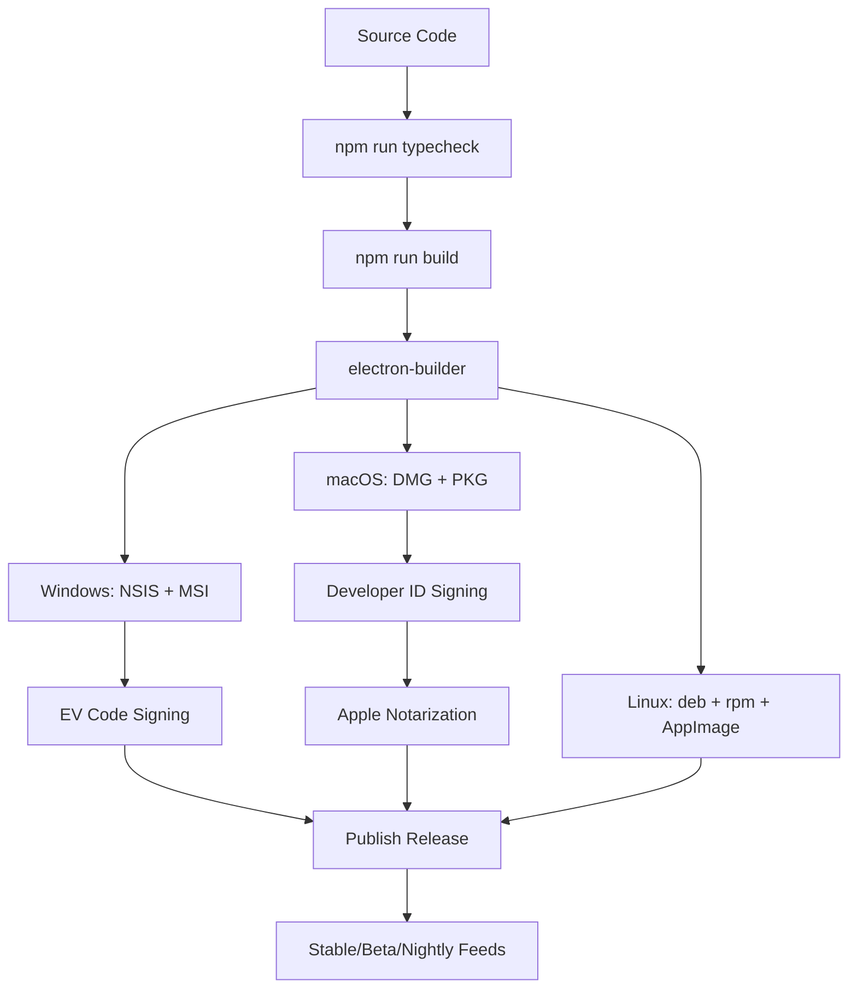
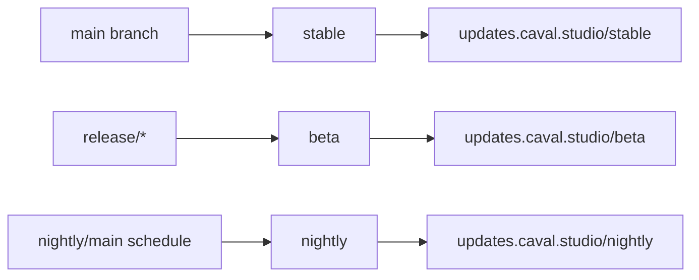

# Build System Architecture

Caval Studio uses Electron, TypeScript, Webpack and electron-builder for cross-platform packaging.

## Pipeline

## CI/CD

Recommended stages:

1. Install dependencies.
2. Typecheck.
3. Build Webpack bundles.
4. Package per platform.
5. Sign artifacts.
6. Notarize macOS artifacts.
7. Generate update feeds.
8. Publish GitHub/S3/custom release.
9. Smoke test update feed.

## Release Channels

## Platform Targets

- Windows: `.exe`, `.msi`, NSIS installer.
- macOS: `.dmg`, `.pkg`, hardened runtime, notarization.
- Linux: `.deb`, `.rpm`, `.AppImage`.

## Security

- Windows EV certificate signing.
- macOS Developer ID Application signing.
- Apple notarization.
- SHA512 release feed verification.
- Signed auto-update verification.

## Delta Updates

`installer/updater/delta-generator.ts` provides the delta manifest scaffold. Production should replace the placeholder XOR algorithm with a battle-tested binary diff format such as bsdiff, Courgette-style delta, or provider-native differential updates.
