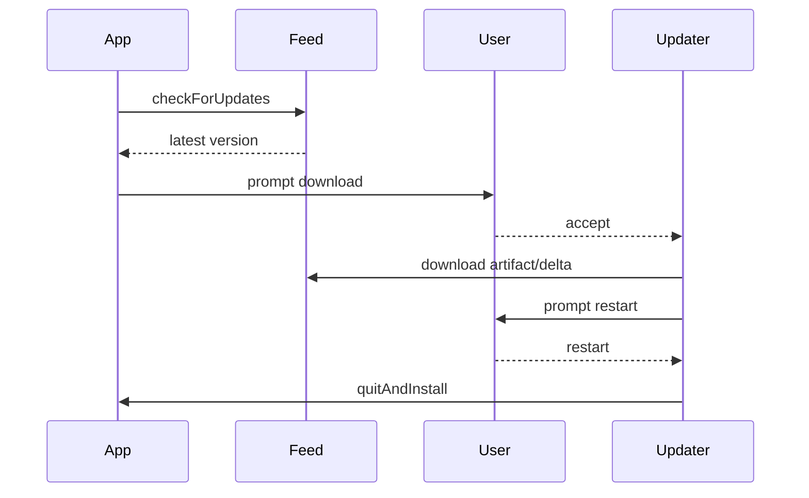

# Caval Studio Installer

## Build Commands

```bash
npm run dist:win
npm run dist:mac
npm run dist:linux
npm run dist:all
```

Set release channel:

```bash
CAVAL_RELEASE_CHANNEL=stable npm run dist:all
CAVAL_RELEASE_CHANNEL=beta npm run dist:all
CAVAL_RELEASE_CHANNEL=nightly npm run dist:all
```

## Code Signing

### Windows

Configure EV certificate:

- `CAVAL_WIN_CERT_SHA1` or `CAVAL_WIN_CERT_FILE`
- `CAVAL_WIN_CERT_PASSWORD`

Manual signing:

```bash
tsx installer/scripts/sign-windows.ts release/stable/Caval-Studio.exe
```

### macOS

Configure:

- `CAVAL_MAC_DEVELOPER_ID`
- `CAVAL_APPLE_ID`
- `CAVAL_APPLE_TEAM_ID`
- `CAVAL_APPLE_APP_PASSWORD`

Manual signing:

```bash
tsx installer/scripts/sign-macos.ts "release/stable/mac/Caval Studio.app"
tsx installer/scripts/notarize-macos.ts release/stable/Caval-Studio.dmg
```

## Publish Releases

```bash
GITHUB_TOKEN=... CAVAL_RELEASE_CHANNEL=stable npm run release:publish
```

Publish targets are configured in `installer/config/electron-builder.yml`:

- GitHub Releases
- S3
- Generic custom update server

## Auto-Update

`installer/updater/auto-updater.ts` uses `electron-updater`:

1. Check feed.
2. Ask user to download.
3. Download update.
4. Ask for restart.
5. Quit and install.



## Release Channels

- Stable: production users.
- Beta: early adopters.
- Nightly: internal/high-frequency builds.

Each channel has an independent release folder and feed.

## Crash Reporting

`installer/updater/crash-reporter.ts` supports Sentry-compatible or custom crash upload endpoints.
