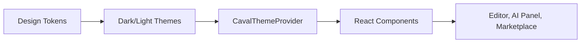
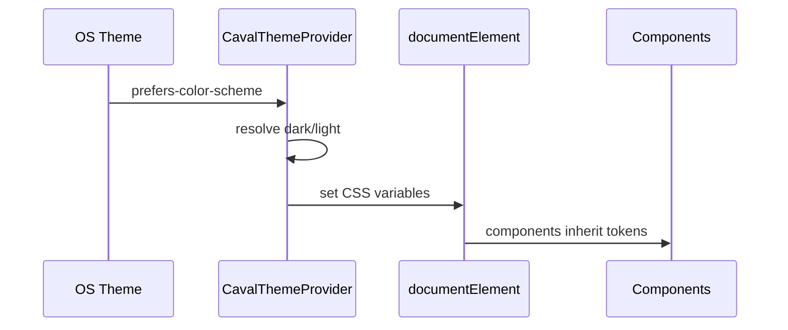

# Caval Studio UI Kit

Caval Studio UI Kit este design system-ul pentru un IDE premium, dens si clar: flow inspirat de Glovo, claritate Cursor, densitate JetBrains, coerenta Figma si identitate Caval cu linii verticale si cyan glow.

## Tokens

- `tokens/colors.ts` defineste Graphite Black, Deep Blue, Cyan Pulse, Soft White, Carpathian Gold, Forest Green si Mountain Grey.
- `tokens/typography.ts` foloseste Inter pentru UI, Sora pentru headings si JetBrains Mono pentru cod.
- `tokens/spacing.ts` foloseste sistem 4px.
- `tokens/radii.ts` standardizeaza 4 / 8 / 12px plus variante premium.
- `tokens/shadows.ts` include shadow-uri subtile si glow cyan/gold.
- `tokens/z-index.ts` defineste sidebar, panel, AI panel, modal, tooltip si toast.

## Componente

- `Button`: primary, secondary, ghost, destructive, icon button.
- `Input` si `Textarea`: text, password, search, erori accesibile.
- `Select`: dropdown si searchable.
- `Checkbox` si `Toggle`: monoline, smooth motion.
- `Tooltip`: delay, arrow, keyboard/focus support.
- `Modal`: overlay, escape close, focus trap.
- `Panel`: AI, settings, marketplace si default.
- `Sidebar`: iconografie monoline si active state cyan.
- `Tabs`: underline si pill.
- `List` si `Card`: extensii, fisiere, search results.
- `Badge`: info, success, warning, error, premium.
- `Toast`: notificari non-intruzive.

## Layout

- `layout/grid.ts`: 12-column grid cu gap de 16px.
- `layout/flex.ts`: helpers pentru row, column, center, between.
- `layout/containers.ts`: app, page, panel si dense panel.

## Theming

`CavalThemeProvider` suporta:

- runtime switching intre dark/light/system;
- OS theme prin `prefers-color-scheme`;
- CSS variables pe `document.documentElement`;
- tema dark principala cu accent Cyan Pulse si glow.

## Iconografie

- `CavalIcon`: simbol vertical inspirat din caval, cu glow cyan si accent Carpathian Gold.
- `monoline-icons.tsx`: file, folder, search, AI, settings, marketplace, debug si run.

## Animatii

- `transitions.ts`: fade, slide, scale si timing-uri fast/normal/slow.
- `micro-interactions.ts`: hover lift, press, focus ring si AI glow pulse.

## Best Practices

- Foloseste token-uri, nu valori hardcodate.
- Pastreaza densitatea pentru IDE, dar nu sacrifica aria de click.
- Orice componenta interactiva trebuie sa aiba focus state vizibil.
- Cyan glow este accent de orientare, nu decor aplicat peste tot.
- Pentru Marketplace si AI Panel foloseste `Panel` + `Card` + `Badge` pentru consistenta.
